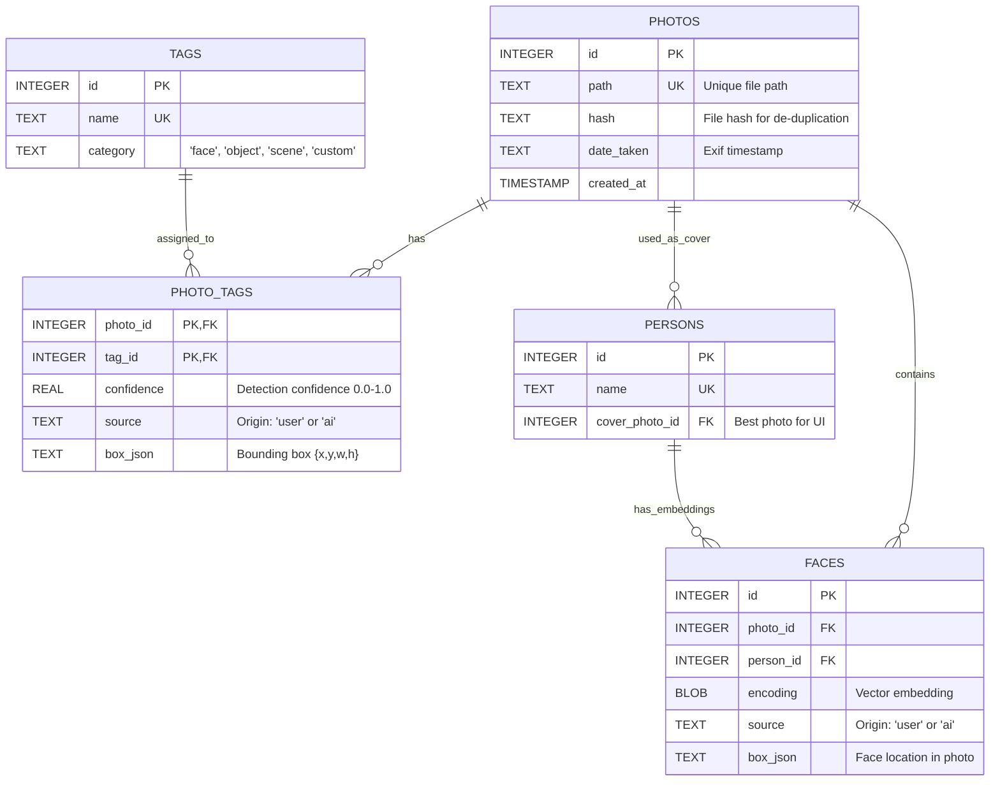

# Database Schema Documentation

This document describes the SQLite database structure for Project Aloha.

## Entity Relationship Diagram

## Tables Description

### 1. `photos`
Stores the master list of all ingested images.
- **path**: Absolute path to the file. Must be unique.
- **hash**: SHA-256 (or similar) hash of the image content to detect duplicates.
- **date_taken**: Extracted from EXIF data.

### 2. `tags`
Central dictionary of all tags (objects, scenes, custom keywords).
- **category**: `object`, `scene`, `custom`, `face`.

### 3. `photo_tags`
Junction table linking Photos to Tags (Many-to-Many).
- **confidence**: AI confidence score.
- **source**: `'user'` (manual) or `'ai'` (auto).
- **box_json**: Region of interest.

### 4. `persons`
Represents unique individuals.
- **name**: Person's name.

### 5. `faces`
Specific face detections.
- **encoding**: Face embedding vector.
- **source**: `'user'` or `'ai'`.
- **person_id**: Link to `persons`.
